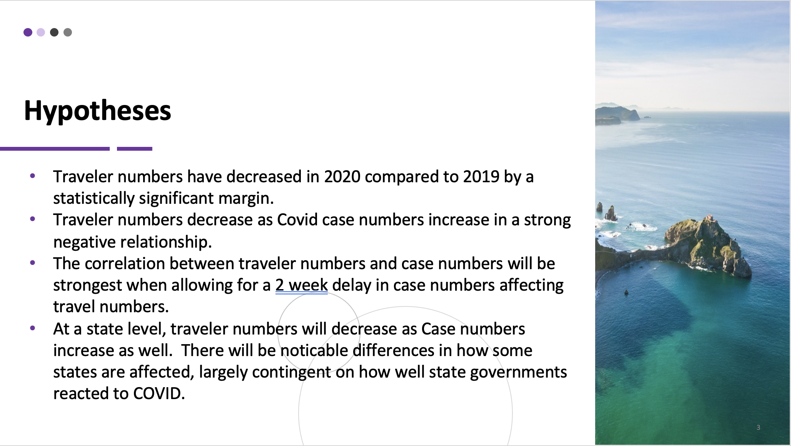

# project1

The presentation requirements for Project 1 are as follows.
Your presentation must:

 Be at least 8-10 min. long

 Describe the core message or hypothesis for your project.

 Describe the questions you and your group found interesting, and what motivated you to answer them

 Summarize where and how you found the data you used to answer these questions

 Describe the data exploration and cleanup process (accompanied by your Jupyter Notebook)

 Describe the analysis process (accompanied by your Jupyter Notebook)

 Summarize your conclusions. This should include a numerical summary (i.e., what data did your analysis yield), as well as visualizations of that summary (plots of the final analysis data)

 Discuss the implications of your findings. This is where you get to have an open-ended discussion about what your findings "mean".

 Tell a good story! Storytelling through data analysis is no different than in literature. Find your narrative and use your analysis and visualization skills to highlight conflict and resolution in your data.
